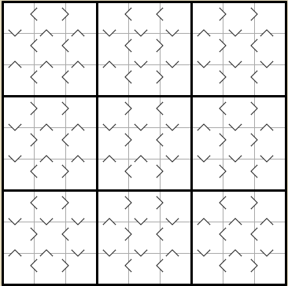
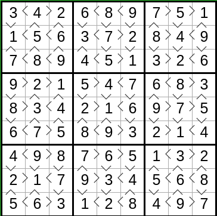
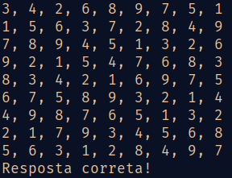

# VergleichsSudoku

### Aluno: Vitor Fernando da Silva (20201566)

---

    [VergleichsSudoku](https://www.janko.at/Raetsel/Sudoku/Vergleich/index.htm) é um quebra-cabeça lógico semelhante ao Sudoku. Para além de todas as regras do jogo Sudoku, o jogador deve inserir um número em cada campo, para que todas as condições de comparação sejam atendidas.

---

# Regras

1. Escreva números de 1 a N nas células da grade de tamanho NxN, para que cada número ocorra exatamente uma vez em cada linha, em cada coluna e em cada região.
2. Os sinais ">" entre duas células indicam que o número na célula que aponta é maior que o número na célula apontada.

---

# Exemplo (9x9)

## Vazio

<div>
    </img>
</div>

## Completo

<div></img></div>

---

# Solução implementada

Para a solução, a linguagem **Scala** foi escolhida.

## 1 - Entrada

A entrada se dá por um documento de texto simples (.txt). Como o puzzle começa sempre como uma matriz de ordem MxM vazia, as únicas informações necessárias são uma matriz com as comparações a serem feitas em cada posição do tabuleiro e a ordem M da matriz.

Exemplo de documento .txt usado para representar a matriz de comparações:

```latex
..<>,>.><,<..<,..<>,>.<>,>..>,..><,<.>>,<..<
.<<<,>><<,>>.<,.<<<,><>>,<<.>,.>>>,<<<>,>>.>
.><.,>><.,>>..,.><.,><>.,<<..,.<>.,<<<.,><..
..>>,<.><,<..<,..>>,<.<>,>..>,..<<,>.>>,<..<
.<>>,<><<,>>.<,.<><,<<<<,><.>,.>>>,<<>>,<>.>
.<<.,>>>.,<>..,.><.,>>>.,<<..,.<>.,<<<.,><..
..<>,>.>>,<..>,..><,<.>>,<..>,..<<,>.><,<..<
.<><,<<<<,><.>,.>>>,<<<>,><.<,.><>,>><<,>>.>
.><.,>>>.,<<..,.<<.,><<.,>>..,.<<.,>>>.,<<..
```

Cada posição contem uma string (como por exemplo .<<<) e cada string é separada por uma vírgula. Deste modo é possível criar uma matriz com a mesma ordem da matriz do puzzle onde cada posição no puzzle está "mapeada" para uma posição na matriz de comparações. 

A classe Puzzle foi criada para receber a matriz inicialmente vazia do puzzle junto da matriz de comparações e a ordem das matrizes. Também contem um Boolean para verificar o termino da solução e o nome do arquivo correspondente a entrada.

```scala
class Puzzle(
              val puzzle: Array[Array[Int]],  // Matriz do puzzle
              // Matriz de comparações para cada posição da matriz do puzzle
              val comparacoes: Array[Array[String]],
              val fName: String,  // Nome do arquivo para carregar o puzzle
              val ordem: Int,  // Ordem das matriz
              var isComplete: Boolean = false
            )
```

A pasta puzzles/ contem alguns arquivos .txt que guardam tabuleiros válidos para o puzzle. Para escolher um para solucionar basta alterar puzzleName com o nome do arquivo (sem o .txt) e ordem com a ordem das matrizes dentro do método main no arquivo main.scala.

```scala
object Main {
  def main(args: Array[String]): Unit = {
    val puzzleName = "n-11" // Nome do arquivo para alterar
    val ordem = 9
    val puzzle = LoadPuzzle.load(puzzleName, ordem)
    Solution.solve(puzzle)
  }
}
```

## 2 - Saída

A saída se dá pelo terminal junto de uma mensagem com o status da solução (correto, incorreto) e o tabuleiro com as alterações feitas.

Exemplo saída:



## 3 - Descrição da solução

### Classe Puzzle

A classe Puzzle foi criada para armazenar tanto o tabuleiro do puzzle quanto a matriz de comparações junto de informações necessárias para a resolução do puzzle.

```scala
class Puzzle(
              val puzzle: Array[Array[Int]],  // Matriz do puzzle
              // Matriz de comparações para cada posição da matriz do puzzle
              val comparacoes: Array[Array[String]],
              val fName: String,  // Nome do arquivo para carregar o puzzle
              val ordem: Int,  // Ordem das matriz
              var isComplete: Boolean = false
            )
```

### Matriz de comparações

Para satisfazer a regra do puzzle uma matriz de comparações foi criada. Ela contem a mesma ordem que a matriz do tabuleiro do puzzle e armazena uma string em cada posição. Deste modo cada posição na matriz do tabuleiro está "mapeada" com cada posição da matriz de comparações. A matriz é carregada no inicio do programa e armazenada dentro de uma instãncia da classe Puzzle.

### Implementação das regras do puzzle

#### Regra 1 - Sudoku

Escreva números de 1 a N nas células da grade de tamanho NxN, para que cada número ocorra exatamente uma vez em cada linha, em cada coluna e em cada região.

Para satisfazer esta regra o método isValidNum foi criado. Ao final do método, a validação da regra 2 também é adicionada.

```scala
  private def isValidNum(puzzle: Puzzle, i: Int, j: Int, num: Int): Boolean = {
    if (puzzle.puzzle(i).contains(num))
      return false

    if (puzzle.puzzle.map(n => n(j)).contains(num))
      return false

    val row = (i / 3) * 3
    val col = (j / 3) * 3
    var box = true

    breakable {
      for (n <- row until row + 3) {
        for (m <- col until col + 3) {
          if (puzzle.puzzle(n)(m) == num) {
            box = false
            break()
          }
        }
      }
    }

    box && checkRegra(puzzle, i, j, num)
  }
```

#### Regra 2 - Comparação

Regra: Os sinais ">" entre duas células indicam que o número na célula que aponta é maior que o número na célula apontada.

Para satisfazer esta regra, determinada posição no tabuleiro precisa satisfazer regras de comparação com seus vizinhos. Como exemplo, a posição **(2, 3)** no tabuleiro do puzzle deve satisfazer certas comparações (maior ou menor) com seus vizinhos (2, 2), (1, 3), (2, 4), (3, 3). 

Para conhecer essas comparações precisamos da string na posição **(2, 3)** na matriz de comparações. Digamos que essa string seja <.<>, o index 0 da string (char <) representa a comparação feita a esquerda de **(2, 3)**, o index 1 (char .) representa a comparação feita em cima de **(2, 3)**, o index 2 (char <) representa a comparação feita a direita de **(2, 3)** e o index 3 representa a comparação feita em baixo de **(2, 3)**. O char . representa nenhuma comparação, o char < representa uma comparação de menor e o char > uma comparação de maior.

Os métodos checkRegraHelper e checkRegra foram criados para implementar a regra. checkRegra é utilizado dentro do método isValidNum para validar a regra 2.

```scala
  private def checkRegraHelper(puzzle: Puzzle, i: Int, j: Int, num: Int, comparacao: Char): Boolean = {
    if (comparacao == '>') {
      val num2 = puzzle.puzzle(i)(j)
      return num2 == 0 || num > num2
    } else if (comparacao == '<') {
      val num2 = puzzle.puzzle(i)(j)
      return num2 == 0 || num < num2
    }
    true
  }
```

```scala
  private def checkRegra(puzzle: Puzzle, i: Int, j: Int, num: Int): Boolean = {
    val comp = puzzle.comparacoes(i)(j)  // Obtem a string das comparações
    checkRegraHelper(puzzle, i, j - 1, num, comp(0)) &&
      checkRegraHelper(puzzle, i - 1, j, num, comp(1)) &&
      checkRegraHelper(puzzle, i, j + 1, num, comp(2)) &&
      checkRegraHelper(puzzle, i + 1, j, num, comp(3))
  }
```

### Backtracking

Para a implementação do algoritmo o método solve foi criado. Ele se utiliza do algoritmo de backtracking. 

O algoritmo deve varrer a matriz do puzzle e em cada posição testar os números entre 1 e a ordem da matriz. Sempre que encontrar um número válido para a posição, deve alterar o valor na posição para o número válido e repetir o processo para a próxima posição. Deste modo, o método solve vai avançando dentro da matriz do puzzle enquanto encontrar números válidos para colocar e ao chegar no fim da matriz chama o método TestSolution.Test. No momento que TestSolution.test for acionado o atributo isComplete de puzzle (instãncia de Puzzle) é alterado para true e o método solve para de testar novos números.

```scala
  def solve(puzzle: Puzzle, i: Int = 0, j: Int = 0): Unit = {
    // Puzzle completo
    if (puzzle.isComplete) return
    // Passou por todas as posições do puzzle
    else if (i >= puzzle.ordem) TestSolution.test(puzzle)
    // Chegou ao final de uma coluna, seguir para a linha seguinte
    else if (j >= puzzle.ordem) solve(puzzle, i + 1)
    // Encontrou uma posição preenchida, seguir para a próxima coluna
    else if (puzzle.puzzle(i)(j) != 0) solve(puzzle, i, j + 1)
    else {
      // Encontrou um lugar para preencher
      // Testar todos os números válidos entre 1 e a ordem do puzzle
      // Caso encontre um número válido, colocar o número na posição (i, j)
      // e passar para a próxima posição
      breakable {
       for (n <- 1 to puzzle.ordem) {
         if (isValidNum(puzzle, i, j, n)) {
           puzzle.puzzle(i).update(j, n)
           solve(puzzle, i, j + 1)
           puzzle.puzzle(i).update(j, 0)
         }
         // Evita continuar tentando após encontrada a solução
         if (puzzle.isComplete)
           break()
       }
      }
    }
  }
```
